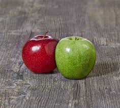

# Mini Project (Computer vision)

## Course overview

## Prerequisite
- Basic programming skills (preferably in Python)
- Familiarity with linear algebra and calculus
- Understanding of basic probability and statistics

## Course content
Starting from week 2, the course outline is as follows:
1. Python fundamentals
3. Basic image & video operations
4. Basic concepts of digital image
5. Image processing I
6. Image processing II
7. Edge detection
8. Color-based segmentation
9. Image classification (Traditional ML & DL)
10. Semantic segmentation

## Course materials & References

## Assignment & Projects
- Weekly programming assignments
- Mid-term project: Image processing
- Final project: Developing a complete pipeline / model to tackle CV problems

## Access notebooks in Google colab
- Week 2 notebook: [](https://colab.research.google.com/github/Jacky-lim-data-analyst/mini_project_cv/blob/main/w2_tutorial.ipynb)
   - Week 2 Exercise solution: [](https://colab.research.google.com/github/Jacky-lim-data-analyst/mini_project_cv/blob/main/w2_tut_ans.ipynb)
- Week 3 notebook: [](https://colab.research.google.com/github/Jacky-lim-data-analyst/mini_project_cv/blob/main/w3_tutorial.ipynb)
   - Week 3 Exercise solution: [](https://colab.research.google.com/github/Jacky-lim-data-analyst/mini_project_cv/blob/main/w3_tut_ans.ipynb)
- Week 4 notebook: [](https://colab.research.google.com/github/Jacky-lim-data-analyst/mini_project_cv/blob/main/w4_tutorial.ipynb)
   - Week 4 Exercise solution: [](https://colab.research.google.com/github/Jacky-lim-data-analyst/mini_project_cv/blob/main/w4_tut_ans.ipynb)
- Week 5 notebook: [](https://colab.research.google.com/github/Jacky-lim-data-analyst/mini_project_cv/blob/main/w5_tutorial.ipynb)
   - Week 5 Exercise solution: [](https://colab.research.google.com/github/Jacky-lim-data-analyst/mini_project_cv/blob/main/w5_tut_ans.ipynb)
- Week 6 notebook: [](https://colab.research.google.com/github/Jacky-lim-data-analyst/mini_project_cv/blob/main/w6_tutorial.ipynb)
- Week 8 notebook: [](https://colab.research.google.com/github/Jacky-lim-data-analyst/mini_project_cv/blob/main/w8_demo_project.ipynb)
- Week 9 notebook: [](https://colab.research.google.com/github/Jacky-lim-data-analyst/mini_project_cv/blob/main/w9_demo_project.ipynb)

> **Warning** 🚨
> It should be noted that the execution of `cv.imshow()` in Google Colab will cause exception. The workaround is as follow:

 ```{python}
from google.colab.patches import cv2_imshow
cv2_imshow(image)
```
---
# Week 8 in-class project 

## Project title: Red and green apples detection

### Overview
- **Objective**: segment the red and green apples (objects) in different images.
- **Recommended method**: Color-based approach
- **Resources**: OpenCV

### Dataset
Sample dataset can be found at: `images/w8/apples`

### Deliverable example
Example input image:



Example of corresponding output segmented image:


## Project title: circles detection

### Overview
- **Objective**: detect circular object(s) in different images.
- **Recommended method**: Shape-based approach
- **Resources**: OpenCV

### Dataset
The dataset can be found at: `images/w8/circles`

### Deliverable example
Example input image:


Example of corresponding output segmented image:


## Project title: rectangles detection

### Overview
- **Objective**: detect rectangular object(s) in different images
- **Recommended method**: Shape-based approach
- **Resources**: OpenCV

### Dataset
The dataset can be found at: `images/w8/rectangles`

### Deliverable example
Example input image:


Example of corresponding output segmented image:


## Project title: Document scanner and OCR

### Overview
- **Objective**: perform optical character recognition (OCR) on detected document in different images.
- **Recommended method**: Low-level image processing algorithms: edge detection, perspective transform and OCR engine like Tesseract.
- **Resources**: OpenCV and tesseract. To install tesseract, please refer to this [OverStack forum post](https://stackoverflow.com/questions/46140485/tesseract-installation-in-windows)

#### Installation of Pytesseract on Windows:
To accomplish OCR with Python on Windows, you will need Python and OpenCV which you already have, as well as Tesseract and the Pytesseract Python package.

**To install Tesseract OCR for Windows**:

1. Download the [installer](https://github.com/UB-Mannheim/tesseract/wiki).
2. Run the installer.

**To install and use Pytesseract on Windows**:
1. Simply run `pip install pytesseract`
2. You will need to add the following line in your code in order to be able to call pytesseract on your machine: `pytesseract.pytesseract.tesseract_cmd = 'C:\\Program Files\\Tesseract-OCR\\tesseract.exe'` depending on path where you installed your Tesseract OCR.

### Dataset
The dataset can be found at: `images/w8/docs`

### Deliverable example
Be able to print out the text present in an image on console.

---
